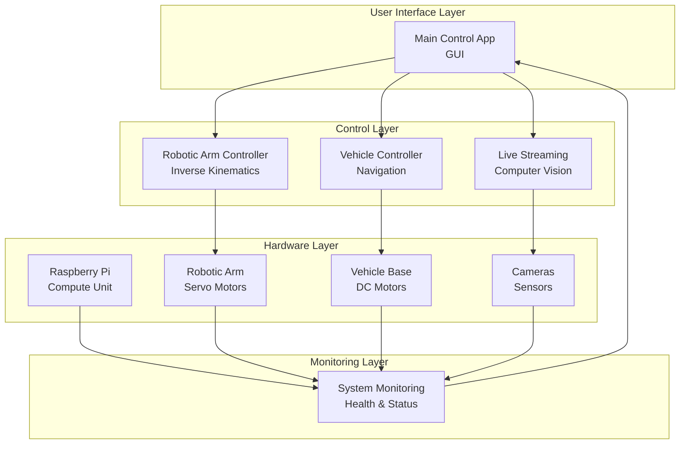

# 2CS-Project-Integration 🤖

A comprehensive distributed robotics control system developed as a team project, featuring real-time control, computer vision, and system monitoring capabilities.

## 📦 Project Components

| Component | Role | Technologies | Repository |
|-----------|------|--------------|------------|
| **Main Control Application** | Central GUI & system coordinator | Python, Threading | [:link: View Repository](https://github.com/7afidhou/2CS_Project_Full-Robot-Control-App) |
| **Robotic Arm Control** | Inverse kinematics & servo control | Python, Robotics, GPIO | [:link: View Repository](https://github.com/7afidhou/2CS_Project_Arm-code) |
| **Vehicle Control System** | Navigation & motor control | Python, Motor Drivers, PWM | [:link: View Repository](https://github.com/7afidhou/2CS_Project_Car-control-code) |
| **Live Streaming Module** | Real-time video & computer vision | Python, OpenCV, Streaming | [:link: View Repository](https://github.com/7afidhou/2CS_Project_Livestream-code) |
| **System Monitoring** | Hardware health & status monitoring | Python, System Monitoring | [:link: View Repository](https://github.com/7afidhou/2CS_Project_RaspberryPi-status-code) |

## 🏗️ System Architecture

## 🔄 System Workflow
User Input → Main Control App receives commands via GUI

Command Distribution → Control app routes commands to appropriate subsystems

Hardware Execution → Arm/Vehicle/Streaming modules control physical hardware

Real-time Feedback → System monitoring collects status data

Visual Feedback → Live streaming provides video feedback to user

Status Updates → All components report back to main control app

## 🎯 Key Technical Features

### Integrated Control Architecture
- Distributed system design with modular components

- Real-time inter-process communication

- Fault-tolerant error handling

- State synchronization across subsystems

### 🦾 Advanced Robotic Arm System
- Inverse kinematics algorithms for precise positioning

- Servo motor control with smooth trajectory planning

- Coordinate space transformations

- Collision avoidance and safety limits

### Intelligent Vehicle Navigation
- Differential drive control for precise movement

- Motor PWM management and speed control

- Sensor integration for environmental awareness

- Path execution and odometry tracking

### Computer Vision Pipeline
- Multi-camera streaming infrastructure

- Real-time video processing with OpenCV

- Frame synchronization and buffering

- Visual feedback for operational awareness

### System Health Monitoring
- Resource utilization tracking (CPU, memory, temperature)

- Hardware status monitoring and alerting

- Performance metrics collection

- Log aggregation and analysis
