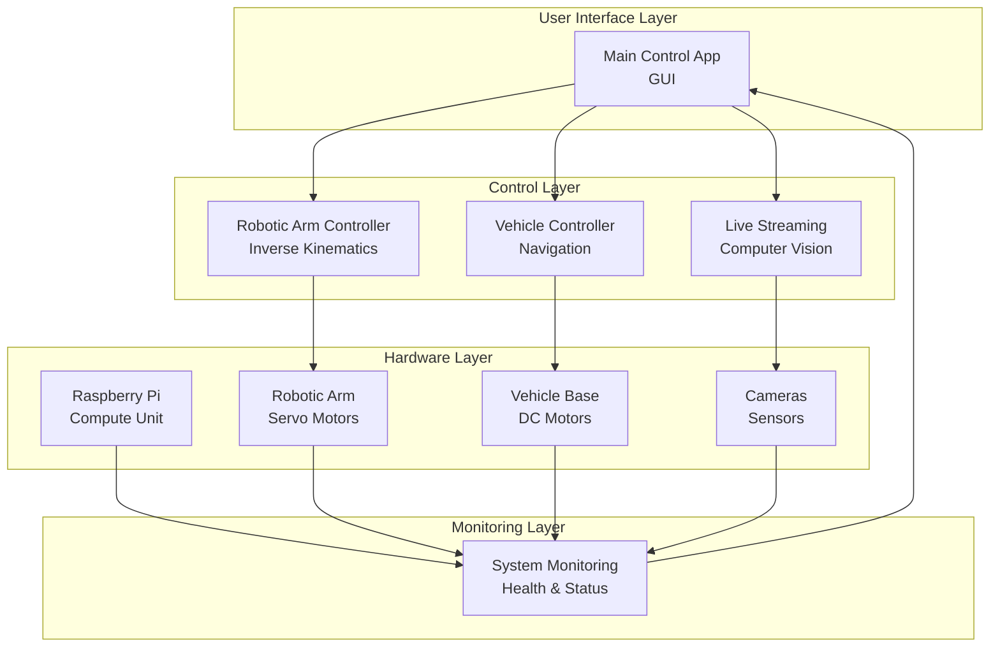

# 2CS-Project-Integration 🤖

A comprehensive distributed robotics control system developed as a team project, featuring real-time control, computer vision, and system monitoring capabilities.

## 🚀 Quick Navigation
- [Projects Overview](#project-Components)
- [Architecture](#system-architecture) 
- [Workflow](#system-workflow)
- [Technical Features](#key-technical-feature)
- [Project Details](#specific-details-about-the-project)
- [Future Insights](#future-insights)

## 📦 Project Components

| Component | Role | Technologies | Repository |
|-----------|------|--------------|------------|
| **Main Control Application** | Web dashboard & system coordinator | Python, Flask, Next.js | [:link: View Repository](https://github.com/7afidhou/2CS_Project_Full-Robot-Control-App) |
| **Robotic Arm Control** | 4 DOF arm inverse kinematics | Python, Servo Control, GPIO | [:link: View Repository](https://github.com/7afidhou/2CS_Project_Arm-code) |
| **Vehicle Control System** | 4WD mobile platform control | Python, Motor Drivers, PWM | [:link: View Repository](https://github.com/7afidhou/2CS_Project_Car-control-code) |
| **Live Streaming Module** | Real-time object detection with YOLOv5 | Python, OpenCV, YOLOv5 | [:link: View Repository](https://github.com/7afidhou/2CS_Project_Livestream-code) |
| **System Monitoring** | Raspberry Pi health monitoring | Python, System Monitoring | [:link: View Repository](https://github.com/7afidhou/2CS_Project_RaspberryPi-status-code) |

## 🏗️ System Architecture

## 🔄 System Workflow
User Input → Main Control App receives commands via GUI

Command Distribution → Control app routes commands to appropriate subsystems

Hardware Execution → Arm/Vehicle/Streaming modules control physical hardware

Real-time Feedback → System monitoring collects status data

Visual Feedback → Live streaming provides video feedback to user

Status Updates → All components report back to main control app

## 🎯 Key Technical Features

### Integrated Control Architecture
- Distributed system design with modular components

- Real-time inter-process communication

- Fault-tolerant error handling

- State synchronization across subsystems

### Advanced Robotic Arm System
- Inverse kinematics algorithms for precise positioning

- Servo motor control with smooth trajectory planning

- Coordinate space transformations

- Collision avoidance and safety limits

### Intelligent Vehicle Navigation
- Differential drive control for precise movement

- Motor PWM management and speed control

- Sensor integration for environmental awareness

- Path execution and odometry tracking

### Computer Vision Pipeline
- Multi-camera streaming infrastructure

- Real-time video processing with OpenCV

- Frame synchronization and buffering

- Visual feedback for operational awareness

### System Health Monitoring
- Resource utilization tracking (CPU, memory, temperature)

- Hardware status monitoring and alerting

- Performance metrics collection

- Log aggregation and analysis

## Specific Details About the Project:
- Hardware: Raspberry Pi 3, Pi Camera, 4 DOF arm, 4WD chassis

- Computer Vision: YOLOv5 for object detection

- Web Stack: Flask backend + Next.js frontend

- Team: 5 members

## Future Insights :
- Project Goal: Mobile robot that detects and picks up objects using computer vision

- Integration: All components work together as described in your architecture

- Success: Functional prototype achieved all objectives

- Future Work: Autonomous navigation, enhanced detection, cloud integration
